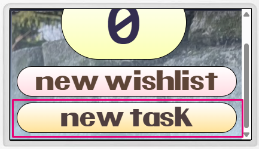
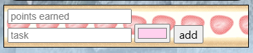
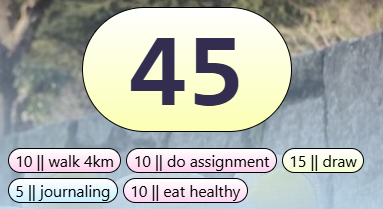
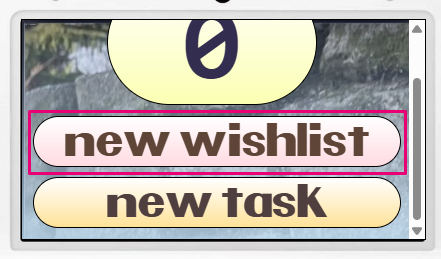
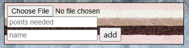
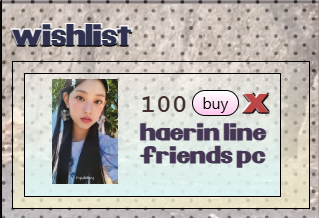
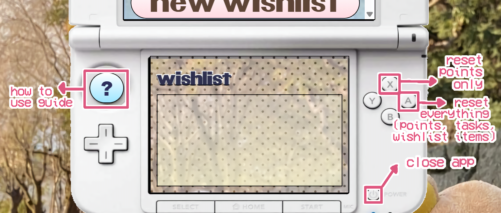

<h1>miiPoint</h4>

welcome to miiPoint! this app helps you to stay motivated to do tasks using a point system and wishlist that you can set up on your own.

<b>!! WARNING !!</b> this app is quite buggy and could mess up your progress. please use at your own risks!!

  
<h2>Task</h2>

  
  
you can add your owns tasks and set how much points they are each worth to complete.

  
  
after adding a new task, they will show up under your total points. <b>right click to delete them!</b>

  

  
<h2>Wishlist</h2>

  
  
with your points, you can save up for a wishlist item that you want. you can also set up the wishlist item by adding an image, how much points it cost, and a name for it!

  
  
after adding your wishlist item, they will show up on the bottom screen. click on the "buy" button if you want to spend your points on it! <b>to delete a wishlist item, right         click on the "buy" button.</b>

  

  
<h2>Wishlist</h2>

  

  
